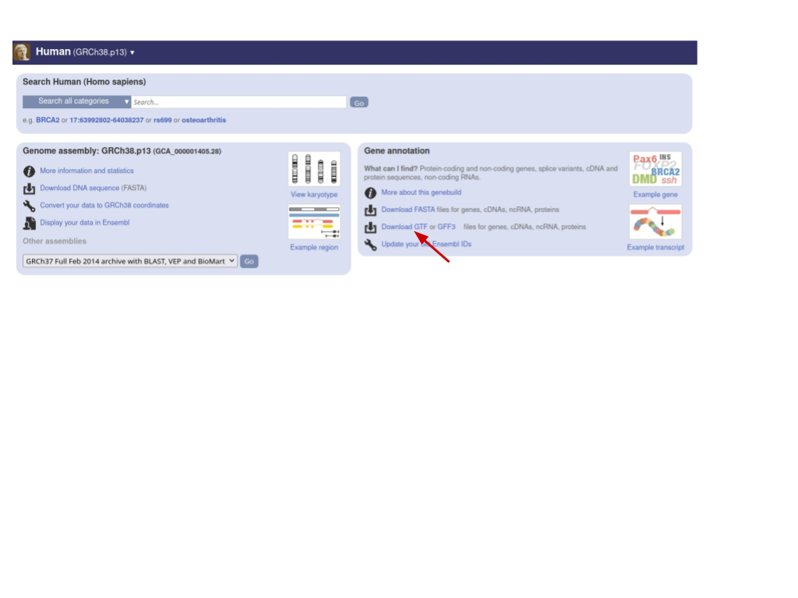

## WEEK3: WORKSHOP Ethan Bahl, edited by Bin He 2023-02-04

## Edit the README file you created last week

_Goal_

Edit the README file in the directory you created last week (should be called `My_project`)

_Steps_

    1. recall where you created the directory (eh, where did I create it? I thought it was here? but there is nothing … - 1hr later - omg… first lesson in reproducible research!)
    2. use `cd` to enter that directory (or recreate one if you can’t find the old one. remember its location this time!)
    3. use `nano` or `vim` to open the README.md file you created last week (hint: `nano READMD.md`)
    4. add a brief description of your project in markdown. include headings like “Introduction”, “Figure to Reproduce”, “Materials and Methods”, “Results”, “Discussion”, “Conclusion”. Try to use bulleted lists and insert an image if you can. (if you haven’t decided which project idea to pick, just randomly choose one for this exercise.)
    5. save the file and exit the editor (if you are using vim, first hit “Esc” to exit the editing mode, then type “:q”, that is, colon followed by q and enter)
    6. turn that markdown file into a pdf by typing  \
`pandoc -o README.pdf README.md`
        * if you see an error like “README.md doesn’t exist”, you are likely in the wrong directory. check using `pwd` and `ls`
        * if you see an error like “Command not found: pandoc”, it means the system you are working on doesn’t have pandoc installed (fastx did have pandoc). In that case, either figure out how to install pandoc on your system or switch to the FastX environment.
    7. you will be asked to upload your output as part of this week’s feedback on Thursday.

## Bash game for learning the basic navigation command

_Goal_

Use a fun game to help you learn how to navigate the unix file system at the command line. You will be asked to share a screenshot of your final award!

_Steps_

1. Go to [https://gitlab.com/slackermedia/bashcrawl](https://gitlab.com/slackermedia/bashcrawl) and click the “download” icon next to “Find file” (you can use any of the formats. if you don’t know, just choose zip). Locate the downloaded zip file, e.g., in your “Downloads” folder.
2. To unzip the file, open a terminal and `cd` into the folder you identified above, e.g., `Downloads`, like this `$ cd Downloads`. Then, issue the following command: `$ unzip bash&lt;Tab>`, where &lt;Tab> means typing Tab. The shell should auto-complete the file name for you. At the completion of this, you should have a `bashcrawl-master` folder, which you can check by `ls`.
3. If you struggle getting the above (download and unzipping) working, try the “Binder” option from the bashcrawl gitlab homepage.
4. Follow the instructions on the frontpage of the repository (the link above) to play the game.
5. Explain what you learned through the game, e.g., “I learned how to create a variable and see its value” or “I learned how to create a symbolic link as a ‘portal’ to a different location using `ln-s`”

_Bonus_

* Now that you know how to store information in a variable using `export`, let’s try the following command \
`$ export PS1="[\u@\h:\W]$"`
* What do you notice at the “prompt”, i.e., the beginning of a new line? Try `cd` into a different directory and watch what happens at the prompt.
* If you find this useful, you may want to learn how to make this the “default” in your terminal.

## Practice using Unix command line to parse LARGE files

_Goal_

* We will see how Unix command line tools are uber useful in parsing very large text files, such as the human genome annotation in GTF format. Our goal is to quickly locate the lines pertaining to a gene of interest.

_Data_

* We will be downloading the annotation file from ENSEMBL. You can copy and paste the following URL, or you can simply search for “human genome annotation ensembl” in your favorite search engine, and look for the ENSEMBL site \
[https://useast.ensembl.org/Homo_sapiens/Info/Index](https://useast.ensembl.org/Homo_sapiens/Info/Index) \

* You will be taken to an FTP page. Use the README file to understand the difference between the different options and the GTF format itself.
* Download the “vanilla” GTF file without any tag to your computer. Remember the location, e.g., `~/Downloads`

_Specific goals_

1. Find all rows corresponding to the gene name “SOD1” (or you can pick your favorite gene, e.g., “BRCA1”)
2. Use the information to figure out the gene structure (# of exons, coding exons, etc.)

_Steps_

1. First, try achieving the above goal using GUI tools like a spreadsheet app. To do so, first decompress the file you just downloaded. You can do so by locating the `.gz` file in the Finder / File Explorer / Caja (the folder icon in FastX top panel) app. Double click it and the file will either be decompressed on site or an app window will pop up, giving you the option to extract the content to a specified folder. If the latter, make sure you know where it is extracted to. **record the time when you clicked on the gz file.**
2. Open a spreadsheet app, such Microsoft Excel or FastX/Applications/Office/Libre Office Calc. In the GUI app, open the GTF file you just extracted/decompressed. **record the time when either you succeed in opening the file and finding the rows, or you give up. how long does it take?**
3. Are you able to open and filter the file? If you encounter issues, what is the problem?
4. How can we use the command line tools to achieve our goal? How does it compare with the GUI approach we tried above?
5. The instructor will demonstrate at the end of the class.